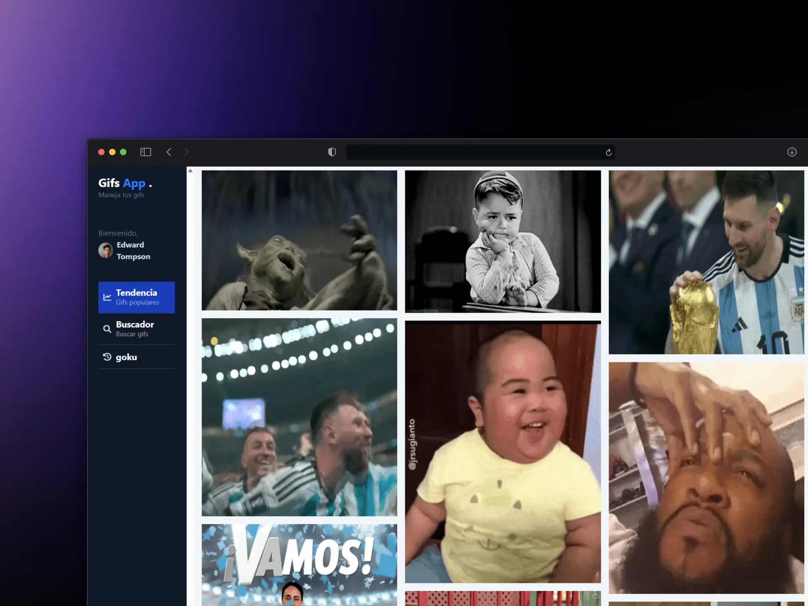

# 🎞️ Gifs App

## 📋 Descripción

Aplicación para buscar y guardar GIFs usando la API de Giphy. Proyecto del módulo de Angular del bootcamp BIT Full Stack — es mi primer acercamiento al framework, así que todavía es un proyecto de aprendizaje en construcción.

> ⚠️ **Nota:** el diseño todavía no es responsive — por ahora solo se ve bien en resoluciones de escritorio. Falta agregar breakpoints de Tailwind para adaptarlo a celular/tablet.

## 🚀 Tecnologías

- Angular (Signals, standalone components, lazy loading)
- TypeScript
- Tailwind CSS
- RxJS
- Giphy API

## ⚙️ Instalación

\`\`\`bash
git clone https://github.com/PhilivG/gifs-app.git
cd gifs-app
pnpm install
\`\`\`

Crea `src/environments/environment.development.ts` con tu propia API key de Giphy:

\`\`\`ts
export const environment = {
  active: true,
  companyName: 'Gifs',
  companyName2: 'App',
  companySlogan: 'Maneja tus gifs',
  apiUrl: 'https://api.giphy.com/v1',
  apiKey: 'TU_API_KEY_AQUI'
}
\`\`\`

## ▶️ Uso

\`\`\`bash
pnpm start
\`\`\`

## 📝 Notas de aprendizaje

Este proyecto es parte de mi proceso aprendiendo Angular desde cero. Ha sido mi primer acercamiento real al framework y me está gustando mucho — cada cosa nueva que aprendo (Signals, standalone components, RxJS) me ha hecho disfrutar más el proceso, y sigo con muchas ganas de seguir explorando todo lo que Angular puede ofrecer.
